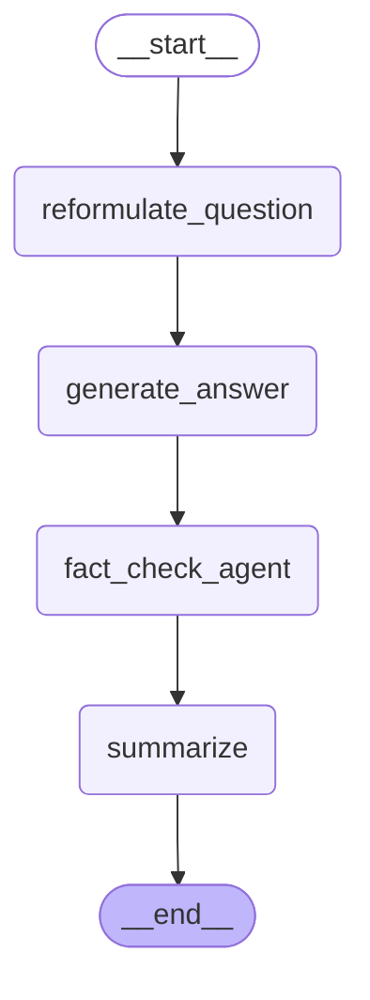

# Agentic-AI-lang-graph-OllamaLLM
Agentic-AI-lang-graph-OllamaLLM


# LangGraph Workflow Diagram




## Langgraph integration
```
https://ollama.com/download/
ollama run llama3.2
ollama pull mistral
ollama run mistral

pip install langchain
pip install langchain_community
pip install langgraph
pip install langchain-ollama --upgrade
```
